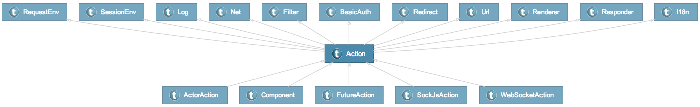
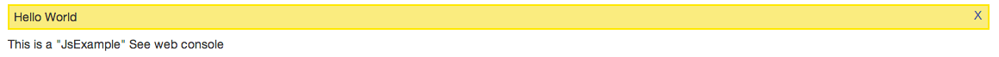

# Xitrumことはじめ　(基本編)

Xitrumことはじめシリーズでは、Xitrumを使ったWebアプリケーション開発を勉強します。

目次は[こちら](http://george-osd-blog.heroku.com/40)

記事とサンプルコードは[MIT](http://opensource.org/licenses/mit-license.php)ライセンスで[github](https://github.com/georgeOsdDev/xitrum-kotohajime)で公開します。

## 6. レスポンスとビュー:

[Xitrum-scalate](https://github.com/xitrum-framework/xitrum-scalate)をテンプレートエンジンに使用することで、
Actionの各メソッドや、現在のActionのインスタンスをViewから使用することができるようになります。
もちろんAction内部でインラインでViewを構成する場合にもAPIが使用できます。
今回はXitrumが提供するViewに関連するAPIを勉強します。

公式ドキュメントは以下のページが参考になります。

 * [Action と view](http://xitrum-framework.github.io/guide/3.18/ja/action_view.html)
 * [テンプレートエンジン](http://xitrum-framework.github.io/guide/3.18/ja/template_engines.html)

### 6-5. Viewに関するAPI

[xitrum.Actionクラス](http://xitrum-framework.github.io/api/3.18/#xitrum.Action)は、
多くのtraitを`with`で継承しており、それらはXitrum内部で使用するもの以外にも、
ユーザーアプリケーションから使用することができるAPIとして提供されています。



具体的なAPIの使用例として
ScaffoldProjectの``DefaultLayout.jade``が参考になります。

#### DefaultLayout.jade

    - import quickstart.action._

    !!! 5
    html
      head
        != antiCsrfMeta
        != xitrumCss

        meta(content="text/html; charset=utf-8" http-equiv="content-type")
        title My new Xitrum project

        link(rel="shortcut icon" href={publicUrl("favicon.ico")})

        link(type="text/css" rel="stylesheet" media="all" href={webJarsUrl("bootstrap/3.2.0/css", "bootstrap.css", "bootstrap.min.css")})
        link(type="text/css" rel="stylesheet" media="all" href={publicUrl("app.css")})

      body
        .container
          h1
            a(href={url[SiteIndex]}) My new Xitrum project

          #flash
            !~ jsRenderFlash()
          != renderedView

        != jsDefaults
        != jsForView


ここでは以下のAPIが使用されています。

 * ``antiCsrfMeta``
 * ``xitrumCss``
 * ``publicUrl``
 * ``webJarsUrl``
 * ``url``
 * ``jsRenderFlash``
 * ``renderedView``
 * ``jsDefaults``
 * ``jsForView``

 実際に出力されるHTMLは以下の通りです。

```
    <!DOCTYPE html>
    <html>
     <head>
       <meta name="csrf-token" content="7c8da946-1b53-47de-8a62-b2d361e96510"/>
       <link href="/webjars/xitrum/3.16/xitrum.css?mhIAFrxv3tBMQXtHcoYT7w" type="text/css" rel="stylesheet" media="all"/>
       <meta content="text/html; charset=utf-8" http-equiv="content-type"/>
       <title>My new Xitrum project</title>
       <link rel="shortcut icon" href="/favicon.ico?BjK0shXmVIuSRS0IsYBdHA"/>
       <link type="text/css" rel="stylesheet" media="all" href="/webjars/bootstrap/3.2.0/css/bootstrap.css?4pWKTr6RZtuqbFkxGygQIQ"/>
       <link type="text/css" rel="stylesheet" media="all" href="/app.css?V0CGnmnzXFV6l7a-UkY_7w"/>
     </head>
     <body>
       <div class="container">
         <h1>
           <a href="/">My new Xitrum project</a>
         </h1>
         <div id="flash">
         </div>
          <!-- DefaultLayoutを継承した各ActionのrenderedViewの結果がここに出力される -->
       </div>
             <script type="text/javascript" src="/webjars/jquery/2.1.1/jquery.js?dAMGCVD0oTvjs9_eBJDuBQ"></script>
             <script type="text/javascript" src="/webjars/jquery-validation/1.12.0/jquery.validate.js?MoZJHtxFQR8TR6gNokHx2w"></script>
             <script type="text/javascript" src="/webjars/jquery-validation/1.12.0/additional-methods.js?VMrHLE7MT-YZGBg3T6jSGA"></script>
             <script type="text/javascript" src="/webjars/sockjs-client/0.3.4/sockjs.js?G6ezG627D2WKnJ3F55SoNQ"></script>
             <script type="text/javascript" src="/xitrum/xitrum.js?BMfHCVrVdosDpgtIlbqZWw"></script>
     </body>
    </html>
```

まず、``antiCsrfMeta``は``csrf-token``というメタタグに展開されています。
このタグはxitrum.js内の処理によって、ajaxリクエスト実行時にリクエストヘッダーに自動で含められることになります。
xitrumはcsrf対策として、put/post/deleteリクエストを受け付けた場合デフォルトでcsrfトークンの妥当性をチェックします。

このtokenは、``antiCsrfInput``または``antiCsrfToken``として取得することも可能です。
後程のサンプルで実際に使ってみます。

なお、Actionでcsrfトークンチェックを無効にしたい場合は、[``xitrum.SkipCsrfCheck``](https://github.com/xitrum-framework/xitrum/blob/46f330ac6c360688417406dcc1539ebb8704b721/src/main/scala/xitrum/SkipCsrfCheck.scala)traitを
継承します。

次に、``xitrumCss``です。
こちらは、単純なCSSファイルへのlinkタグに展開されます。
xitrum.jsを使用している場合に、使われるクラスが定義されています。アプリケーションで不要なら必ずしも記載する必要はありません。

つづいて、``url``、``publicUrl``、``webjars``です。
これらはそれぞれ、ActionへのURL，``public``ディレクトリへのURL、``webJar``へのURLへと展開されます。
また、``publicUrl``、``webjars``は各リソースのETagに応じてクエリストリングを自動で付加してくれます。
このほか、``@sockjs``アノテーションに対応したActionのURLを取得する``sockJsUrl``、
``@websocket``アノテーションに対応したActionのURLを取得する``、urlwebSocketAbsUrl``などがあります。
（websocketの場合、ws/wssスキーマも含めたフルパスが取得できます。）

``<div id="flash">``および、``jsRenderFlash``はxitrum.jsと組み合わせて、
ちょっとしたアラートを出すための記述になります。
Action内で``flash``メソッドで追加した文字列が表示されます。
具体的な使用例はのちほど。

``jsDefaults``はjQuery、jQuery-validation、sockJS、xitrum.jsが展開されます。
``xitrum.js`` は具体的には
https://github.com/xitrum-framework/xitrum/blob/master/src/main/scala/xitrum/js.scala
が該当します。
xitrum.jsは前述のajaxリクエストに対するcsrf攻撃対策トークンを含めることの他に、
jqueryValidationの実行、postback関連のクライアント処理、flashメッセージ出力処理などが記載されています。
主にクライアントサイドとサーバーサイドの連携、バリデーションを目的とした機能となります。
アプリケーションに応じてこれらの処理が不要であれば、``jsDefaults``は必ずしも記載する必要はありません。

``jsForView``にはAction内で``jsAddToView``で追加したjavaScript文字列が展開されます。


そのほか、ActionからViewへパラメータを渡す``at``や、i18n文字列を生成する``t``などのView用APIがあります。
それではatを使ったサンプルを作ってみたいと思います。

#### ViewAPIExample.scala

    case class Person(name:String,age:Int)

    @GET("/viewapi/at")
    class AtExample extends Action {
      def execute() {

        at("key1") = "value"

        at("taro") = new Person("Taro", 10)

        at("jiro") = new Person("Jiro", 20)

        at("serializable") = Map("key" -> "val")

        respondView()
      }
    }


この例ではリクエストを受け付けた際に、``at``メソッドを使用して"key1"、"key2"という名前でそれぞれ、
文字列とオブジェクトを保存しています。

#### AtExample.jade

    - import quickstart.action.Person

    - val key1Value = at("key1").asInstanceOf[String]
    - val person = at("taro").asInstanceOf[Person]
    - val person2 = at[Person]("jiro")

    div
      p "key1"
      p = key1Value

      p "taro"
      p = person.name
      p = person.age

      p "jiro"
      p = person2.name
      p = person2.age

      p "toJson"
      p = at.toJson("serializable")

Viewの方では、Scalaコードで``at``からキーと型を指定して値を取得します。
``at``の実態は実はHashMap[String, Any]です。（https://github.com/xitrum-framework/xitrum/blob/46f330ac6c360688417406dcc1539ebb8704b721/src/main/scala/xitrum/scope/request/At.scala）
そのため値を取得する際は型を指定する必要があります。

次はJavaScriptに関連するAPIとして、``flash``と``jsAddToView``および``jsForView``メソッドを使ってみます。


#### ViewAPIExample.scala

    @GET("/viewapi/js")
    class JsExample extends DefaultLayout {
      def execute() {

        flash("Hello World")

        jsAddToView("""console.log("Hello js Add To View")""")

        jsAddToView("""console.log("Hello js Add To View Again!")""")

        respondView()
      }
    }

#### JsExample.jade

    p This is a "JsExample" See web console

この例では、リクエストを受け付けると、``flash``メソッドに"Hello World"という文字列を登録、
その後``jsAddToView``メソッドを2回呼び出してそれぞれjavascriptのコードを登録しています。
実際に http://localhost:8000/viweapi/js にアクセスして返されるhtmlには、
DefaultLayout内の``jsForView``が以下のように展開されています。

```
    <script type="text/javascript">
        //<![CDATA[
        $(function() {
        console.log("Hello js Add To View");
        console.log("Hello js Add To View Again!");
        xitrum.flash("Hello World");
        });
        //]]>
    </script>
```

また、画面は以下の用になります。

と表示されます。
これは最後の``xitrum.flash``というxitrum.js内のjavascript関数によって生成されたDOMエレメントとなります。

    xitrum.flash = function (msg) {
      var div =
        '<div class="flash">' +
          '<a class="flash_close" href="javascript:">Ｘ</a>' +
          '<div class="flash_msg">' + msg + '</div>' +
        '</div>';
      $('#flash').append($(div).hide().fadeIn(1000));
    }

flashのスタイルはデフォルトのxitrum.cssを使用していますが
アプリケーションに応じてxitrum.flashやクラスのスタイルをオーバーライドすることも可能です。

    jsAddToView("""xitrum.flash = function(msg){alert("This is custome flash:" + msg);}""")

---

この他にもViewに関するAPI(i18nなど)はいくつかありますが、今回はここまで。
次回は、JavaScript、CSSについてもう少し詳しく見ていきます。
