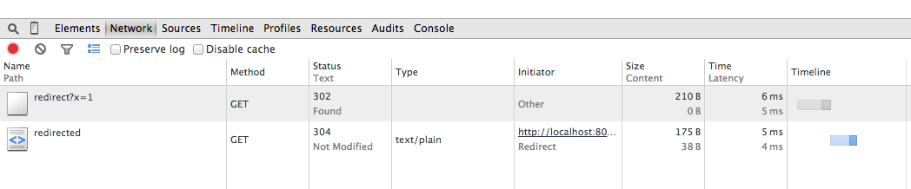
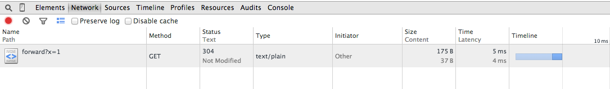

# Xitrumことはじめ　(基本編)

Xitrumことはじめシリーズでは、Xitrumを使ったWebアプリケーション開発を勉強します。

目次は[こちら](http://george-osd-blog.heroku.com/40)

記事とサンプルコードは[MIT](http://opensource.org/licenses/mit-license.php)ライセンスで[github](https://github.com/georgeOsdDev/xitrum-kotohajime)で公開します。

## 6. レスポンスとビュー:

今回は、Actionによるレスポンスのパターンとして、
ポストバック、リダイレクト、フォーワードを取り上げます。

公式ドキュメントは以下のページが参考になります。

 * [ポストバック](http://xitrum-framework.github.io/guide/3.18/ja/postback.html)
 * [HOWTO](http://xitrum-framework.github.io/guide/3.18/ja/howto.html#id2)

### 6-6-1. ポストバック

Xitrumのポストバックは、[Nitrogen](http://nitrogenproject.com/)という、Erlangライブラリを参考に実装されています。
参考:[Nitrogenのポストバックチュートリアル](http://nitrogenproject.com/doc/tutorial.html#sec-37-1)

ポストリクエストに対してインタラクティブにページを生成するための機能と言えます。
Xitrumが提供するポストバックは、Formのポスト処理と、ポスト処理に対するサーバサイドのレスポンスを
クライアントサイドのxitrum.jsがポストバックイベントとしてハンドリングすることで実現されています。

ただし、AngularやBackboneなどのJSフレームワークとJSONレスポンスを用いることでより柔軟なページ生成ができることが
多いため、この機能を使う機会は少ないかもしれません。

### Postback.scala

```scala
@GET("postback")
class PostbackIndex extends DefaultLayout {
  def execute() {
    respondInlineView(
      <form data-postback="submit" action={url[PostbackAction]}>
        <label>Title</label>
        <input type="text" name="title" class="required" /><br />

        <label>Body</label>
        <textarea name="body" class="required"></textarea><br />

        <input type="submit" value="Postback" />
      </form>
      <hr>
      <form data-postback="submit" action={url[PostbackAction2]}>
        <label>Title</label>
        <input type="text" name="title" class="required" /><br />

        <label>Body</label>
        <textarea name="body" class="required"></textarea><br />

        <input type="submit" value="Postback2" />
      </form>    )
  }
}

@POST("postback")
class PostbackAction extends DefaultLayout {
  def execute() {
    val title   = param("title")
    val body    = param("body")
    flash("Posted.")
    jsRedirectTo[PostbackIndex]()
  }
}

@POST("postback2")
class PostbackAction2 extends DefaultLayout {
  def execute() {
    val title   = param("title")
    val body    = param("body")
    jsRespond(s"""$$('body').append('title:$title\\nbody:$body')""")
  }
}
```

この例では、
Postbackボタン、Postback2ボタン共にポストバックリクエストを行います。
違いは、レスポンスにあり１の場合はjsRedirectToを通じてクライアントから再びPostbackIndexへリクエストが行われます。
Postしてもとのページヘバックすることになります。
2の場合はレスポンスしたjavascriptがクライアント側で実行されます。


### 6-6-2. リダイレクト

リダイレクトを行う場合、``redirectTo``を使用します。
クライアントには、HTTPステータス 302が返却され、レスポンスヘッダーには次のリダイレクト先URLが追加されます。

#### Redirect.scala

```scala
@GET("/redirect")
class RedirectIndex extends Action {
  def execute() {
    log.debug("RedirectIndex")
    log.debug(textParams.toString)
    redirectTo[RedirectedPage]()
  }
}

@GET("/redirected")
class RedirectedPage extends Action {
  def execute() {
    log.debug("RedirectedPage")
    log.debug(textParams.toString)
    respondText(getClass)
  }
}
```

上記のActionに対してcurlクライアントからリクエストを行った場合、
以下のような結果となります。

```shell
curl -v http://localhost:8000/redirect\?x\=1
* About to connect() to localhost port 8000 (#0)
*   Trying ::1...
* Adding handle: conn: 0x7fb089003000
* Adding handle: send: 0
* Adding handle: recv: 0
* Curl_addHandleToPipeline: length: 1
* - Conn 0 (0x7fb089003000) send_pipe: 1, recv_pipe: 0
* Connected to localhost (::1) port 8000 (#0)
> GET /redirect?x=1 HTTP/1.1
> User-Agent: curl/7.32.0
> Host: localhost:8000
> Accept: */*
>
< HTTP/1.1 302 Found
< Connection: keep-alive
< Location: /redirected
< Access-Control-Allow-Origin: *
< Access-Control-Allow-Credentials: true
< Access-Control-Allow-Methods: OPTIONS, GET, HEAD
< Content-Length: 0
<
* Connection #0 to host localhost left intact
```

XitrumログにはRedirectIndexへのアクセスのみ表示されます。

```
[DEBUG] RedirectIndex
[DEBUG] Map(x -> List(1))
[INFO] 0:0:0:0:0:0:0:1 GET /redirect?x=1 -> quickstart.action.RedirectIndex, queryParams: {x: 1} -> 302, 1 [ms]
```

ブラウザから上記のURLを表示した場合、ブラウザがリダイレクト用のレスポンスヘッダーを解釈して次のURLへリクエストを自動で作成します。
この時、RedirectIndexへのリクエストとは全く別のリクエストがRedirectedPageへ行われるため、リクエストパラメータは引き継がれません。



Xitrumログは以下のように成ります。

```
[DEBUG] RedirectIndex
[DEBUG] Map(x -> List(1))
[INFO] 0:0:0:0:0:0:0:1 GET /redirect?x=1 -> quickstart.action.RedirectIndex, queryParams: {x: 1} -> 302, 86 [ms]
[DEBUG] RedirectedPage
[DEBUG] Map()
[INFO] 0:0:0:0:0:0:0:1 GET /redirected -> quickstart.action.RedirectedPage -> 200, 43 [ms]
```

### 6-6-3. フォーワード

フォーワードの場合は、処理の流れはクライアントにレスポンスは戻らずに、直接次のアクションへ処理が移ります。
リクエストパラメータはそのままフォーワード先のアクションへと引き継がれます。

#### Forward.scala

```scala
@GET("/forward")
class ForwardIndex extends Action {
  def execute() {
    log.debug("ForwardIndex")
    log.debug(textParams.toString)
    forwardTo[ForwardedPage]()
  }
}

@GET("/forwarded")
class ForwardedPage extends Action {
  def execute() {
    log.debug("ForwardedPage")
    log.debug(textParams.toString)
    respondText(getClass)
  }
}
```

Forwardの場合、クライアントがcurlでもブラウザでも同じ結果となります。

```shell
curl -v http://localhost:8000/forward\?x\=1
* About to connect() to localhost port 8000 (#0)
*   Trying ::1...
* Adding handle: conn: 0x7fdf82006e00
* Adding handle: send: 0
* Adding handle: recv: 0
* Curl_addHandleToPipeline: length: 1
* - Conn 0 (0x7fdf82006e00) send_pipe: 1, recv_pipe: 0
* Connected to localhost (::1) port 8000 (#0)
> GET /forward?x=1 HTTP/1.1
> User-Agent: curl/7.32.0
> Host: localhost:8000
> Accept: */*
>
< HTTP/1.1 200 OK
< Connection: keep-alive
< Content-Type: text/plain; charset=UTF-8
< Access-Control-Allow-Origin: *
< Access-Control-Allow-Credentials: true
< Access-Control-Allow-Methods: OPTIONS, GET, HEAD
< Content-Length: 37
< ETag: "Bz-NYDptSQMU_PgZeFPu0w"
<
* Connection #0 to host localhost left intact
class quickstart.action.ForwardedPage%
```

```
[DEBUG] ForwardIndex
[DEBUG] Map(x -> List(1))
[DEBUG] ForwardedPage
[DEBUG] Map(x -> List(1))
[INFO] 0:0:0:0:0:0:0:1 GET /forward?x=1 -> quickstart.action.ForwardedPage, queryParams: {x: 1} -> 200, 2 [ms]
```




---

今回はこれまで。
レスポンスのパターンはだいたい把握できたので、
次回からは、リクエストパラメーターやスコープについて勉強します。
